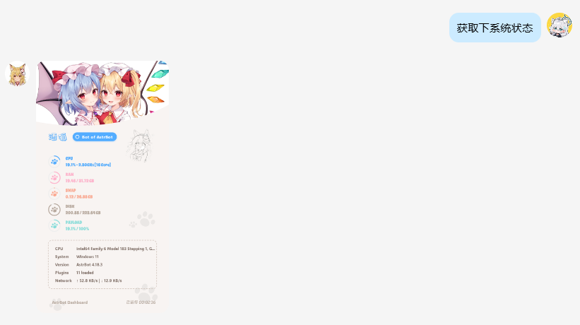
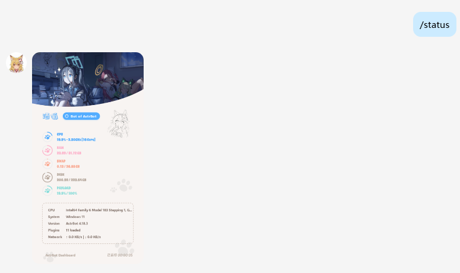

# astrbot_plugin_status

[](LICENSE)
[](https://github.com/AstrBotDevs/AstrBot)

一个用于展示系统状态的简易可爱插件，支持生成可视化的状态卡片。

---

## 📸 预览

<div align="center">
  <table>
    <tr>
      <td align="center">
        
        <br/>
        <sub>状态卡片</sub>
      </td>
      <td align="center">
        
        <br/>
        <sub>LLM 智能分析效果</sub>
      </td>
      <td align="center">
        
        <br/>
        <sub>自定义背景图效果</sub>
      </td>
    </tr>
  </table>
</div>

---

## ✨ 功能特性

- 🖼️ **精美状态卡片** - 可视化展示 CPU、内存、磁盘、网络等系统状态
- 🎨 **自定义背景** - 支持上传自定义背景图片，打造个性化状态卡片
- 🤖 **LLM 智能分析** - 可选开启 AI 分析，自动解读系统状态
- ⚡ **性能优化** - 静态资源缓存、轻量采样，降低系统开销
- 🌐 **多平台支持** - 适配 AstrBot 支持的所有消息平台

---

## 📦 安装

### 方式一：通过 AstrBot 插件市场安装（推荐）

在 AstrBot 管理面板中搜索 `astrbot_plugin_status` 并安装。

### 方式二：手动安装

1. 克隆本仓库到 AstrBot 的插件目录：
   ```bash
   cd AstrBot/data/plugins
   git clone https://github.com/yourusername/astrbot_plugin_status.git
   ```

2. 重启 AstrBot 或重载插件

---

## 🛠️ 配置项

在 AstrBot 管理面板中配置以下选项：

| 配置项 | 类型 | 说明 | 默认值 |
|--------|------|------|--------|
| `bot_name` | 字符串 | 显示在状态卡片上的机器人名称 | `AstrBot` |
| `banner_image` | 文件列表 | 自定义状态背景图（支持 png/jpg/jpeg），可上传多张随机展示 | `[]` |
| `enable_llm_analysis` | 布尔值 | 是否在返回状态图后调用 LLM 进行智能分析 | `false` |
| `llm_analysis_prompt` | 字符串 | LLM 分析时使用的提示词 | `请简要分析这张系统状态图片...` |

### 配置示例

```json
{
  "bot_name": "我的Bot",
  "banner_image": ["/path/to/banner1.png", "/path/to/banner2.jpg"],
  "enable_llm_analysis": true,
  "llm_analysis_prompt": "请分析系统状态，指出是否有异常"
}
```

---

## 📝 使用方法

### 基础命令

发送以下任一指令即可获取系统状态卡片：

```
/状态
/status
```

### 使用 LLM 分析功能

1. 在配置中开启 `enable_llm_analysis`
2. 确保已配置 LLM 提供商
3. 发送 `/状态` 后，Bot 会先发送状态图片，然后自动返回 AI 分析结果


### 自定义背景图

1. 在配置中找到 `banner_image` 项
2. 点击上传按钮选择背景图片（推荐尺寸：1200x600 或更高）
3. 保存配置后发送 `/状态` 查看效果

---

## 📚 相关链接

- [AstrBot 官方仓库](https://github.com/AstrBotDevs/AstrBot)
- [AstrBot 插件开发文档（中文）](https://docs.astrbot.app/dev/star/plugin-new.html)
- [AstrBot 插件开发文档（English）](https://docs.astrbot.app/en/dev/star/plugin-new.html)

---

## 📄 开源协议

本项目基于 [MIT](LICENSE) 协议开源。

---